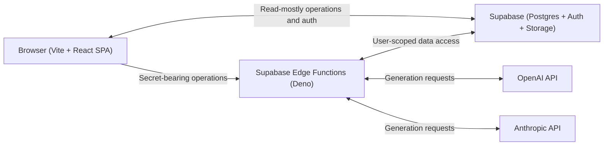

# buildmap Architecture

This document is the canonical architecture source of truth for buildmap. It supersedes architectural defaults in any general agent guidance, including `CLAUDE.md`.

## 1. System Overview

buildmap is a planning and memory workspace for AI-assisted builders. It helps a user move from product intent to durable project context, structured documents, executable feature chunks, tracked issues, and retained learnings, while AI generation is mediated through secured backend boundaries.



The SPA communicates directly with Supabase for read-mostly operations governed by Row Level Security (RLS). Any operation requiring a secret, including an AI provider API key, goes through a Supabase Edge Function.

## 2. Tech Stack

- **Frontend:** Vite, React 18+, TypeScript in strict mode, Tailwind CSS, shadcn/ui, React Router for client-side routing, Zod for validation, and the Supabase JS client.
- **Backend:** Supabase Postgres, Supabase Auth, Supabase Storage, and Supabase Edge Functions on the Deno runtime. There is no separate Node backend, Express server, Fastify server, or custom server.
- **AI:** The OpenAI SDK and Anthropic SDK, both invoked only from Edge Functions.
- **Tooling:** ESLint, Prettier, and TypeScript strict mode.
- **Deployment:** Vercel or Netlify for the SPA; Supabase CLI for Edge Functions and database migrations.

## 3. Repository Structure

```text
buildmap/
|-- .gitignore
|-- README.md
|-- AGENTS.md
|-- CLAUDE.md
|-- context/
|   |-- 01-project-overview.md
|   |-- 02-architecture.md
|   |-- 03-code-standards.md
|   |-- 04-ai-workflow-rules.md
|   |-- 05-ui-context.md
|   |-- 06-progress-tracker.md
|   `-- decisions.md
|-- feature-specs/
|   `-- .gitkeep
|-- frontend/
|   `-- README.md
`-- backend/
    `-- README.md
```

This is a single repository with two top-level application folders: `frontend/` and `backend/`. They keep SPA concerns separate from Supabase functions, migrations, and backend-owned shared boundaries while allowing a solo developer to change an end-to-end feature in one branch and review one atomic diff.

The code review recommendation to use two separate repositories for frontend and backend is deliberately not adopted. A single repository with two folders provides faster solo-development iteration, simpler coordinated changes, and one decision trail. If ownership or release independence becomes more important as the team grows, this decision can be revisited.

`backend/_shared/` may be imported from `frontend/` by relative path for shared Zod schemas only. No other cross-folder imports are allowed: backend runtime utilities, AI code, logging, authentication helpers, and response code remain backend-only.

## 4. Frontend Architecture

The frontend is a Vite + React + TypeScript single-page application with one entry point at `frontend/src/main.tsx`. It has no Next.js layer and no server-side rendering.

Routing uses React Router. All routes under `/dashboard`, `/projects/*`, and `/settings` are protected by an authentication guard.

Server state is managed by React Query (TanStack Query), authentication state is managed through React Context, and all other state remains component-local. Redux and Zustand must not be added unless explicitly approved in a later decision.

The planned `frontend/src/` layout is:

```text
src/
  components/        (shadcn/ui primitives + composed components)
  features/          (one folder per feature: dashboard, prd, architecture, chunks, etc.)
  lib/               (logger, supabase client, utilities)
  config/            (env.ts - typed env access)
  constants/         (errors.ts, routes.ts, etc.)
  hooks/             (shared hooks)
  types/             (frontend-specific types only)
  pages/             (route-level components)
  main.tsx
  App.tsx
```

## 5. Backend Architecture

Supabase Edge Functions live at `backend/functions/<function-name>/index.ts`. Shared backend code lives in `backend/_shared/`, including the logger, AI abstraction, error constants, standard response envelope, Zod schemas, and authentication helpers. Database migrations live under `backend/supabase/migrations/`; RLS policies are written alongside migrations, with one migration per logical change.

Every Edge Function must:

- Validate input with Zod.
- Authenticate using the Supabase JWT in the `Authorization` header.
- Return the standard response envelope: `{ ok: true, data } | { ok: false, error: { code, message } }`.
- Use correct HTTP status codes: `200`, `201`, `400`, `401`, `403`, `404`, `422`, `429`, and `500`.
- Log only through the shared logger; `console.log` is forbidden in committed code.

## 6. Database Model

The high-level application tables are:

- `users` (a mirror of `auth.users` for application-level fields)
- `projects`
- `project_documents`
- `feature_chunks`
- `feature_specs`
- `project_issues`
- `project_learnings`
- `generation_logs`

Every application table has RLS enabled with policies scoping rows to `auth.uid()`. The Supabase-managed `auth.users` table is not an application table. Full table schemas and policies are defined in Chunk 04.

## 7. Authentication Model

- **Provider:** Supabase Auth.
- **Enabled methods:** Email/password and Google OAuth. Clerk is not used.
- **Sessions:** The Supabase JS client manages session storage in `localStorage` by default.
- **Frontend API:** An `AuthProvider` context exposes `user`, `session`, `loading`, `signIn`, `signUp`, `signInWithGoogle`, and `signOut`.
- **Protected routes:** A `<RequireAuth>` wrapper redirects users without a session to `/sign-in`.
- **Edge Functions:** Every function reads the JWT from the `Authorization: Bearer <token>` header, verifies it through Supabase, and uses the resulting `user.id` for every user-data query.

## 8. Authorization Model

All authorization is enforced server-side through Postgres RLS. The frontend never trusts itself for authorization: it may hide unavailable UI, but the database must deny unauthorized queries.

Edge Functions do not bypass RLS. They use the user's JWT, not the service role key, for all user-data queries. The service role key is reserved for system-level operations such as logging and cleanup and is never used for user-data queries.

## 9. AI Provider Abstraction

The AI abstraction lives at `backend/_shared/ai/` and exposes this public interface:

```ts
generate(type: GenerationType, input: unknown): Promise<GenerationResult>
```

A configuration map lives in `backend/_shared/ai/config.ts`:

```ts
type GenerationConfig = {
  provider: 'openai' | 'anthropic';
  model: string;
  systemPrompt: string;
};

const config: Record<GenerationType, GenerationConfig>;
```

The `generate` function reads the mapped configuration, dispatches to the appropriate provider client, validates output with Zod, and returns a typed result. Both `OPENAI_API_KEY` and `ANTHROPIC_API_KEY` are stored as Supabase Edge Function secrets and are never committed.

The default provider mapping, to be reviewed in Chunk 02, is:

- Short structured generations (clarifying questions, prompt generation, and error-to-spec) -> OpenAI.
- Long-form documents (PRD, architecture, feature specs, and context files) -> Anthropic.
- Knowledge extraction -> Anthropic.

The mapping is configurable. Switching the provider for a generation type requires changing one line in `config.ts`, with no feature code changes.

## 10. Validation Strategy

Zod is the validation library. Shared schemas live in `backend/_shared/schemas/`, and the frontend imports only those schemas via a relative path:

```ts
import { ProjectCreateSchema } from '../../../backend/_shared/schemas/project';
```

Every Edge Function validates input with Zod at its boundary. Invalid input returns HTTP `422` with the standard error envelope. Every frontend form uses the same Zod schema for client-side validation so that client and backend validation do not drift.

## 11. Logging Strategy

Logging uses a tiny custom wrapper of approximately 20 lines per side. The frontend wrapper lives at `frontend/src/lib/logger.ts`; in production builds where `import.meta.env.PROD === true`, its `debug` and `info` methods are no-ops while `warn` and `error` emit through `console.warn` and `console.error`. The backend wrapper lives at `backend/_shared/logger.ts`; it reads `Deno.env.get('ENVIRONMENT')` and makes `debug` and `info` no-ops in `production`.

ESLint enforces `no-console: error` everywhere except inside the logger files themselves. `console.log` is forbidden in committed code. Sensitive data, including tokens, passwords, full user objects, and API responses containing secrets, must never be passed to the logger; code review enforces this rule.

## 12. Error Handling Strategy

All API-response error messages live in `backend/_shared/constants/errors.ts` as a typed enum. The frontend mirrors user-facing copy in `frontend/src/constants/errors.ts`.

Every Edge Function wraps its handler in a top-level `try/catch` and returns the standard envelope with the appropriate HTTP status. The frontend uses React Query error state for request failures and a global error boundary for unhandled rendering errors.

## 13. Response Envelope

Every Edge Function returns:

```ts
type ApiResponse<T> =
  | { ok: true; data: T }
  | { ok: false; error: { code: string; message: string } };
```

HTTP status codes follow REST conventions:

- `200` - success on read or update.
- `201` - success on create.
- `400` - malformed request.
- `401` - missing or invalid authentication.
- `403` - authenticated but unauthorized.
- `404` - resource not found.
- `422` - validation failed.
- `429` - rate limited.
- `500` - unhandled server error.

## 14. Deployment

The SPA is deployed to either Vercel or Netlify, with the platform decision deferred to Chunk 31. Its build command is `npm run build` from `frontend/`, producing `frontend/dist/`.

Edge Functions are deployed from `backend/`:

```bash
supabase functions deploy <name>
```

Migrations are applied from `backend/`:

```bash
supabase db push
```

Two CI workflows are planned for Chunk 31: one for SPA deployment and one for backend functions and migrations. These are separate deploys.

## 15. Architectural Risks

- The single-repository, two-folder layout deliberately deviates from the code review recommendation. If the team grows beyond one or two engineers, splitting frontend and backend into two repositories becomes worth reconsidering.
- Cross-folder relative imports from `frontend/` into `backend/_shared/schemas/` are tolerated for Zod schemas only. If imports expand to runtime code, refactor immediately.
- Supabase Edge Functions run on Deno, and not all npm packages are compatible. Backend dependency compatibility must be verified before adding any package.
- Provider switching at the AI layer assumes both providers can handle the same prompt shape. If a provider returns malformed JSON, generation fails; Zod validation of every output is the safety net.
